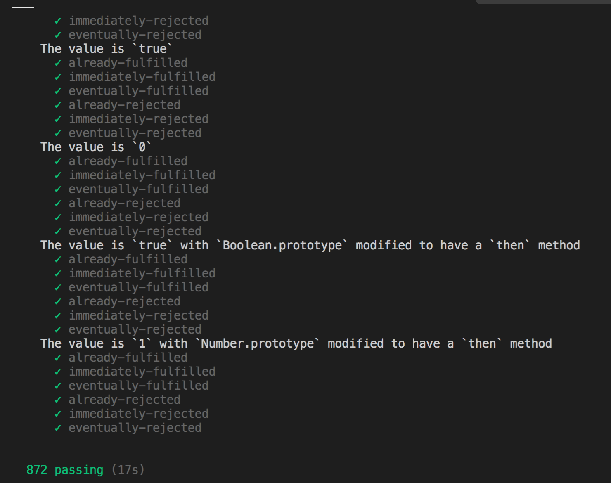

# 从零手写promise原理

> 如果不了解promise。或者对promise了解不够深入的可以看下这个文件同级目录下的knowPromise.md文件

> 也可以查看[Promises/A+](https://promisesaplus.com/) 官方文档

### 搭建环境

#### 生成package.json
```
npm init -y
```
#### 局部安装

```bash
npm install typescript rollup @rollup/plugin-node-resolve rollup-plugin-typescript2 -D
```
typescript 运行tsc命令

rollup 打包

@rollup/plugin-node-resolve 需要使用第三方模块

rollup-plugin-typescript2 rollup和ts做一个关联

#### 生成tsconfig.json

```bash
npx tsc --init  
```
修改tsconfig.json 
 >  "commonjs"改为'ESNEXT'

####  新建rollup.config.js 新建src模块 src/index.ts
```js

import path from 'path'
import ts from 'rollup-plugin-typescript2';
import {nodeResolve} from '@rollup/plugin-node-resolve'
export default{
    input:'src/index.ts',
    output:{
        format:'cjs',//common.js规范 umd esm life
        file:path.resolve(`dist/bundle.js`)
    },
    plugins:[  //解析的时候用的ts插件
        ts({
            tsconfig:path.resolve(`tsconfig.json`)
        }),
        nodeResolve({
            extensions:['.js','.ts']  //扩展名
        })
    ]
}
```
#### 配置package.json

rollup -c -w
-c:意思是使用配置文件进行打包 .config
-w:每次文件变化了做一个实时监控 watch

```json
{
  "name": "promise",
  "version": "1.0.0",
  "description": "",
  "main": "index.js",
  "scripts": {
    "test": "echo \"Error: no test specified\" && exit 1",
    "dev":"rollup -c -w"
  },
  "keywords": [],
  "author": "",
  "license": "ISC",
  "devDependencies": {
    "@rollup/plugin-node-resolve": "^10.0.0",
    "rollup": "^2.33.3",
    "rollup-plugin-typescript2": "^0.29.0",
    "typescript": "^4.1.2"
  }
}
```
#### 本地运行ts 
```
npm install ts-node -g
```
#### 安装vscode插件  code runner


进入正题：

### 手写promise


promise构造函数的理解：

1、构造函数有个状态属性，有三种状态
```js
const enum STATUS{  //存放所需要的状态
    pending = 'PENDING',
    fulfilled = 'FULFILLED',
    rejected = 'REJECTED'
}
```

2、构造函数自己有resolve和reject两个方法
有 value和reason两个属性，分别表示成功原因和失败原因，传给回调函数then
```js
  const resolve = (value?:any)=>{
        if(this.status==STATUS.pending){
            this.status = STATUS.fulfilled;
            this.value = value;
        }
    }
    const reject = (reason?:any)=>{
        if(this.status==STATUS.pending){
            this.status = STATUS.rejected;
            this.value = reason;
        }    
    }
```

3、关于promise.then的理解：

>  onFulfilled 是Promise.then传入的第一个参数

>  onRejected是Promise.then传入的第二个参数

执行关于promise.then的时候根据status的变化，判断执行那个函数

如果状态是成功就执行onFulfilled函数，同时把resolve的value值传给onFulfilled函数

如果是失败就执行onejected函数，同时把reject的value值传给onRejected函数

```js
 then(onFulfilled,onRejected){
        if(this.status == STATUS.fulfilled){
            onFulfilled(this.value)
        }
        if(this.status == STATUS.rejected){
            onRejected(this.reason)
        }
  }
```
完整一点点的代码段

```js
const enum STATUS{  //存放所需要的状态
    pending = 'PENDING',
    fulfilled = 'FULFILLED',
    rejected = 'REJECTED'
}
 class Promise{
     status:STATUS;
     value:any;
     reason:any;
    constructor(executor){
        this.status = STATUS.pending; //当前默认状态
        this.value = undefined;//成功原因
        this.reason = undefined;//失败原因
        const resolve = (value?:any)=>{
            if(this.status==STATUS.pending){
                this.status = STATUS.fulfilled;
                this.value = value;
            }
        }
        const reject = (reason?:any)=>{
            if(this.status==STATUS.pending){
                this.status = STATUS.rejected;
                this.reason = reason;
            }    
        }
        try{
            executor(resolve,reject);
        }catch(e){
            reject(e)     
        }
       
    }
    then(onFulfilled,onRejected){
        if(this.status == STATUS.fulfilled){
            onFulfilled(this.value)
        }
        if(this.status == STATUS.rejected){
            onRejected(this.reason)
        }
    }

 }
 export default Promise

```

调用自己手写的promise结果如下：

```js
const Promise = require('./bundle.js')
let promise = new Promise((resolve,reject)=>{
    resolve('ok');
})
promise.then((data)=>{
    console.log('success',data)
},(err)=>{
    console.log('failed',err)
})
// success ok
```
4、上面的情况在普通情况下显示正常，但是如果new Promise里面是一个延时器就会出现问题

如下：
```js
const Promise = require('./bundle.js')
let promise = new Promise((resolve,reject)=>{
    setTimeout(()=>{
        resolve('1')
    },1000)
})
promise.then((data)=>{
    console.log('success',data)
},(err)=>{
    console.log('failed',err)
})
```

会发现没打印出任何东西，因为promise的状态还没发生改变时，已经走了then,然后then里面没有对pending的状态做处理，所以没有任何反应。

解决办法：then方法里面获取当前的状态，如果当前是等待状态，则先把成功回调和失败的回调暂存起来，等状态不是pending的时候调用

代码如下：
```js

const enum STATUS{  //存放所需要的状态
    pending = 'PENDING',
    fulfilled = 'FULFILLED',
    rejected = 'REJECTED'
}
 class Promise{
     status:STATUS;
     value:any;
     reason:any;
     onResolvedCallbacks:Function[];
     onRejectedCallbacks:Function[];
    constructor(executor){
        this.status = STATUS.pending; //当前默认状态
        this.value = undefined;//成功原因
        this.reason = undefined;//失败原因
        this.onResolvedCallbacks = [];//成功回调的函数集合
        this.onRejectedCallbacks = [];//失败回调的函数集合
        const resolve = (value?:any)=>{
            if(this.status==STATUS.pending){
                this.status = STATUS.fulfilled;
                this.value = value;
                //发布模式
                this.onResolvedCallbacks.forEach(fn=>fn());
            }
        }
        const reject = (reason?:any)=>{
            if(this.status==STATUS.pending){
                this.status = STATUS.rejected;
                this.reason = reason;
                this.onRejectedCallbacks.forEach(fn=>fn())
            }    
        }
        try{
            executor(resolve,reject);
        }catch(e){
            reject(e)     
        }
       
    }
    then(onFulfilled,onRejected){
        if(this.status == STATUS.fulfilled){
            onFulfilled(this.value)
        }
        if(this.status == STATUS.rejected){
            onRejected(this.reason)
        }
        //如果当前是等待状态，则先把成功回调和失败的回调暂存起来，等状态不是pending的时候调用
        if(this.status == STATUS.pending){
            this.onResolvedCallbacks.push(()=>{
                //可以增加额外的逻辑
                onFulfilled(this.value)  //订阅模式
            })
            this.onRejectedCallbacks.push(()=>{
                 //可以增加额外的逻辑
                 onRejected(this.reason)
            })
        }
    }
 }
 export default Promise
```
调用手写的promise，效果如下：
```js
const Promise = require('./bundle.js')
let promise = new Promise((resolve,reject)=>{
    setTimeout(()=>{
        resolve('成功')
    },1000)
})
promise.then((data)=>{
    console.log('success',data)
},(err)=>{
    console.log('failed',err)
})
//success 成功
```
5、链式调用

 调用then方法会产生一个全新的promise（不能返回this，因为状态不可逆，所以只能是新的promise）

1、普通值  
- 当then返回的是一个普通值,则走下一个then成功的方法

手写promise，
由于调用then方法会产生一个全新的promise，则假设then里面会产生一个全新的promise2，实现原理如下：
then方法里面获取当前的状态，不管是那种状态，当返回一个常量的时候都会走成功，把then的返回值，作为下一次成功结果，resolve出去

```js
    then(onFulfilled,onRejected){
        //每次调用then都产生一个全新的promise
        let promise2 = new Promise((resolve,reject)=>{
            if(this.status == STATUS.fulfilled){
                let x = onFulfilled(this.value);
                resolve(x)  //用then的返回值，作为下一次成功结果
            }
            if(this.status == STATUS.rejected){
                let x = onRejected(this.reason)
                resolve(x)  //用then的返回值，作为下一次成功结果
            }
            //如果当前是等待状态，则先把成功回调和失败的回调暂存起来，等状态不是pending的时候调用
            if(this.status == STATUS.pending){
                this.onResolvedCallbacks.push(()=>{
                    //可以增加额外的逻辑
                    let x =  onFulfilled(this.value)  //订阅模式
                    resolve(x)  //用then的返回值，作为下一次成功结果
                })
                this.onRejectedCallbacks.push(()=>{
                     //可以增加额外的逻辑
                     let x = onRejected(this.reason)
                     resolve(x)  //用then的返回值，作为下一次成功结果
                })
            }
        })
        return promise2
    }
```


```js
（1）
const Promise = require('./bundle.js')
let promise2 = new Promise((resolve,reject)=>{
    reject('ok')
}).then(data =>{
    return 100
},err =>{
    return 1
})
promise2.then(data=>{
    console.log('成功2---'+data)
},err=>{
    console.log('失败了2----'+err)
})
//成功2---1
（2）
const Promise = require('./bundle.js')
let promise2 = new Promise((resolve,reject)=>{
    resolve('ok')
}).then(data =>{
    return 100
},err =>{
    return 1
})
promise2.then(data=>{
    console.log('成功2---'+data)
},err=>{
    console.log('失败了2----'+err)
})
//成功2---100

```
2、当then中抛出一个错误时，则不管此时那种状态，下个then都会走失败

实现原理如下：
在新返回的promise2里面，做一个try..catch的处理，使成功的时候走resolve,抛错的时候走reject

```js
    then(onFulfilled,onRejected){
        //每次调用then都产生一个全新的promise
        let promise2 = new Promise((resolve,reject)=>{
            if(this.status == STATUS.fulfilled){
                try{
                    //是个常量的时候
                    let x = onFulfilled(this.value);
                    resolve(x)  //用then的返回值，作为下一次成功结果
                }catch(e){
                    // 抛错的时候
                    reject(e)
                }
              
            }
            if(this.status == STATUS.rejected){
                try{
                    let x = onRejected(this.reason)
                    resolve(x)  //用then的返回值，作为下一次成功结果
                }catch(e){
                     // 抛错的时候
                     reject(e)
                }
                
            }
            //如果当前是等待状态，则先把成功回调和失败的回调暂存起来，等状态不是pending的时候调用
            if(this.status == STATUS.pending){
                this.onResolvedCallbacks.push(()=>{
                      //可以增加额外的逻辑
                    try{
                        let x =  onFulfilled(this.value)  //订阅模式
                        resolve(x)  //用then的返回值，作为下一次成功结果
                    }catch(e){
                         // 抛错的时候
                         reject(e)
                    }
                  
                })
                this.onRejectedCallbacks.push(()=>{
                     //可以增加额外的逻辑
                    try{
                        let x = onRejected(this.reason)
                        resolve(x)  //用then的返回值，作为下一次成功结果
                    }catch(e){
                        // 抛错的时候
                        reject(e)
                    }        
                     
                })
            }
        })
        return promise2
    }
```

显示结果：

```js
(1)
const Promise = require('./bundle.js')
let promise2 = new Promise((resolve,reject)=>{
    resolve('ok')
}).then(data =>{
throw new Error('111')
},err =>{
    throw new Error('222')
})
promise2.then(data=>{
    console.log('成功2---'+data)
},err=>{
    console.log('失败了2----'+err)
})
//失败了2----Error: 111
(2)
const Promise = require('./bundle.js')
let promise2 = new Promise((resolve,reject)=>{
    reject('ok')
}).then(data =>{
throw new Error('111')
},err =>{
    throw new Error('222')
})
promise2.then(data=>{
    console.log('成功2---'+data)
},err=>{
    console.log('失败了2----'+err)
})
//失败了2----Error: 222
```
3、当then返回一个promise时
(1)
例子
```js
const Promise = require('./bundle.js')
let promise = new Promise((resolve,reject)=>{
    resolve('ok')
}).then(data=>{
    return new Promise((resolve,reject)=>{
        setTimeout(()=>{
            resolve('xxx')
        },1000)
    })
},err=>{

})
let promise2 = promise.then(data=>{
    console.log(data)
})
```
```js
// 打印的结果
Promise {
  status: 'PENDING',
  value: undefined,
  reason: undefined,
  onResolvedCallbacks: [ [Function] ],
  onRejectedCallbacks: [ [Function] ]
} Promise {
  status: 'PENDING',
  value: undefined,
  reason: undefined,
  onResolvedCallbacks: [],
  onRejectedCallbacks: []
} [Function: resolve] [Function: reject]
```
 核心手写代码

```js
//核心的逻辑 解析x的类型，决定promise2走成功还是失败
function resolvePromise(promise2,x,resolve,reject){
    console.log(promise2,x,resolve,reject)
      // 判断x的值 决定promise2的关系  来判断可能x是别人的promise 可能别人的promise会出现问题
}

 then(onFulfilled,onRejected){
        //每次调用then都产生一个全新的promise
        let promise2 = new Promise((resolve,reject)=>{
            if(this.status == STATUS.fulfilled){
                setTimeout(() => {
                    try{
                        //是个常量的时候
                        let x = onFulfilled(this.value);
                        // console.log(promise2)
                        resolvePromise(promise2,x,resolve,reject)
                        // resolve(x)  //用then的返回值，作为下一次成功结果
                    }catch(e){
                        // 抛错的时候
                        reject(e)
                    } 
                }, 0);
               
              
            }
            if(this.status == STATUS.rejected){
                setTimeout(() => {
                    try{
                        let x = onRejected(this.reason)
                        resolvePromise(promise2,x,resolve,reject)
                        // resolve(x)  //用then的返回值，作为下一次成功结果
                    }catch(e){
                         // 抛错的时候
                         reject(e)
                    }  
                }, 0);
               
                
            }
            //如果当前是等待状态，则先把成功回调和失败的回调暂存起来，等状态不是pending的时候调用
            if(this.status == STATUS.pending){
                this.onResolvedCallbacks.push(()=>{
                      //可以增加额外的逻辑
                      setTimeout(() => {
                        try{
                            let x =  onFulfilled(this.value)  //订阅模式
                            resolvePromise(promise2,x,resolve,reject)
                            // resolve(x)  //用then的返回值，作为下一次成功结果
                        }catch(e){
                             // 抛错的时候
                             reject(e)
                        }
                      },0)
                   
                  
                })
                this.onRejectedCallbacks.push(()=>{
                     //可以增加额外的逻辑
                     setTimeout(() => {
                        try{
                            let x = onRejected(this.reason)
                            resolvePromise(promise2,x,resolve,reject)
                            // resolve(x)  //用then的返回值，作为下一次成功结果
                        }catch(e){
                            // 抛错的时候
                            reject(e)
                        }  
                     })
                         
                     
                })
            }
        })
        return promise2
    }
```

```
then里面的FULFILLED/REJECTED状态时，为什么要加setTimeout，用setTimeout模拟实现微任务 ?
 原因如下：
    - Promises/A+规范 要确保 onFulfilled 和 onRejected 方法异步执行(且应该在 then 方法被调用的那一轮事件循环之后的新执行栈中执行) 所以要在resolve里加上setTimeout
   - Promises/A+规范 对于一个promise，它的then方法可以调用多次.（当在其他程序中多次调用同一个promise的then时，由于之前状态已经为FULFILLED/REJECTED状态，则会走的下面逻辑),所以要确保为FULFILLED/REJECTED状态后，需要异步执行onFulfilled/onRejected
   - 当然也可以使用，queueMicrotask来实现微任务 
```    
(2)判断x的值 和promise2的关系
   -  如果x和promise2指向同一个对象，则抛错（If promise and x refer to the same object, reject promise with a TypeError as the reason.）
```js
//核心的逻辑 解析x的类型，决定promise2走成功还是失败
function resolvePromise(promise2,x,resolve,reject){
    // (如果x和promise2指向同一个对象，则抛错)
    if(x==promise2){
        return reject(new TypeError('出错了'))
    }
}
```
使用
```js
const Promise = require('./bundle.js')
let promise2 = new Promise((resolve,reject)=>{
    resolve('ok')
}).then(data=>{
    return promise2
},err=>{

})
promise2.then(data=>{
    console.log(data)
},err=>{
    console.log(err,'999')
})

//TypeError: 出错了
```

- 如果x是一个promise，则x可能是对象或者函数，否则x是一个普通值
  （是普通值就直接resolve,如果是函数或者对象，就获取x上面的then方法，或者x.then为undefined),则x为普通对象或者函数，就直接resolve，如果x上面的then存在，则以x作为this,第一个参数resolvePromise和第二个参数rejectPromise，其中：resolvePromise参数y，rejectPromise参数r，r作为reason
- x.then中抛出的异常的结果e，就以e作为promise失败的reason
- y可能是一个promise,递归解析y,直到y是一个普通值为止
- y可能是第三方的promise 可能第三方的promise会出现问题（执行了成功就不让其执行失败，执行了失败就不让执行成功）
- onFulfilled和onRejected是可选参数，需要做兼容处理
（ 判断onFulfilled是否传了，如果类型是一个函数，就不做操作，如果不是函数，则返回一个参数为val的函数，val为this.value
```js
    onFulfilled = typeof onFulfilled =='function'?onFulfilled : val=>val;
    onRejected = typeof onRejected =='function'?onRejected:err=>{throw err}）
```

 ```js
//  1、x.then中抛出的异常的结果e，就以e作为promise失败的reason
const Promise = require('./bundle.js');
let resultObj = {};
Object.defineProperty(resultObj,'then',{
    get(){
        throw new Error('出错了');
    }
})
let promise2 = new Promise((resolve,reject)=>{
    resolve('ok')
}).then(data=>{
    return resultObj
},err=>{
    console.log(err,'')
})

promise2.then(data=>{
    console.log(data)
},err=>{
    console.log(err,'999')
})
// 2、当x.then是一个普通函数的时候
const Promise = require('./bundle.js')
let promise = new Promise((resolve,reject)=>{
    resolve('ok')
}).then(data=>{
    return function(){
        console.log(1)
    }
},err=>{

})
let promise2 = promise.then(data=>{
    console.log(data,'dayin')
})
//[Function] dayin
// 3、当x是一个promise的时候
const Promise = require('./bundle.js')
let promise = new Promise((resolve,reject)=>{
    resolve('ok')
}).then(data=>{
    return new Promise((resolve,reject)=>{
        setTimeout(()=>{
            resolve('成功----')
        },1000)
    })
},err=>{

})
let promise2 = promise.then(data=>{
    console.log(data)
})
//成功----
 ```
手写实现

```js
//核心的逻辑 解析x的类型，决定promise2走成功还是失败
// x就是then的返回值
function resolvePromise(promise2,x,resolve,reject){
    // 判断x的值 和promise2的关系  来判断可能x是第三方的promise 可能第三方的promise会出现问题
    // (如果x和promise2指向同一个对象，则抛错)
    if(x==promise2){
        return reject(new TypeError('出错了'))
    }
    if((typeof x==='object' && x!=null) || typeof x==='function'){
        //只有x是对象或者函数才可能是promise
        // console.log(x)
        try{    
            let then = x.then;//取x上的then方法
            console.log(then)
             if(typeof then =='function'){   //这x.then是当前的then链式的下个接收
                then.call(x,y=>{
                    resolve(y);//y是x成功返回的结果
                },r=>{
                    reject(r)
                })
            }else{
                resolve(x);//x是普通函数或者对象
            }
        }catch(e){
            //x.then中抛出的异常的结果e，就以e作为promise失败的reason
            reject(e)//走失败逻辑
        }
    }else{
        //如果不是promise则是一个普通值
        resolve(x)
    }
}
```
4、如果y也是一个promise的时候，如果还是像上面那样解析就会直接放回如下：

```js
const Promise = require('./bundle.js')
let promise = new Promise((resolve,reject)=>{
    resolve('ok');
}).then(data=>{
    return new Promise((resolve,reject)=>{
        setTimeout(()=>{
            //下面的resolve就是指的y
            resolve(new Promise((resolve,reject)=>{
                setTimeout(()=>{
                    resolve(100)
                },1000)
            }))
        },1000)
    })
},err=>{
    console.log(err)
})
let promise2 = promise.then(data=>{
    console.log(data)
},err=>{
    console.log(err,'======')
})
```

```js
Promise {
  status: 'PENDING',
  value: undefined,
  reason: undefined,
  onResolvedCallbacks: [],
  onRejectedCallbacks: []
}
```
但是如果改成这样递归调用resolvePromise，则返回正常的100
```js
 then.call(x,y=>{
    //y可能是一个promise,递归解析y,直到y是一个普通值为止
    resolvePromise(promise2,y,resolve,reject)
    // resolve(y);//y是x成功返回的结果
},r=>{
    reject(r)
})
```
如果rejectPromise被调用，则reject(r)
```js
const Promise = require('./bundle.js')
let promise = new Promise((resolve,reject)=>{
    resolve('ok')
}).then(data=>{
    return new Promise((resolve,reject)=>{
        setTimeout(()=>{
            reject(new Promise((resolve,reject)=>{
                setTimeout(()=>{
                     console.log('失败了-----')
                    resolve(100)
                },1000)
            }))
        },1000)
    })
},err=>{
    console.log(err)
})
let promise2 = promise.then(data=>{
    console.log(data)
},err=>{
    console.log(err,'======')
})
//运行结果如下：
Promise {
  status: 'PENDING',
  value: undefined,
  reason: undefined,
  onResolvedCallbacks: [],
  onRejectedCallbacks: []
} ======
失败了-----
```
y可能是第三方的promise 可能第三方的promise会出现问题（执行了成功就不让其执行失败，执行了失败就不让执行成功）
```js
 if((typeof x==='object' && x!=null) || typeof x==='function'){
        let called = false;//表示没调用过成功和失败
        try{    
            let then = x.then;
            if(typeof then =='function'){   
            
                then.call(x,y=>{
                    if(called) return; //如果已经成功就不能再调失败
                    called = true;
                    resolvePromise(promise2,y,resolve,reject)
                },r=>{
                    if(called) return; //如果已经失败就不能再调成功
                    called = true;
                    reject(r)
                })
            }else{
                resolve(x);
            }
        }catch(e){
            if(called) return;//如果已经失败就不能再调成功
            called = true;
            reject(e)
        }
    }
```
如果没传onFulfilled或者onRejected的，则做兼容处理

```js
// 核心代码
 then(onFulfilled?,onRejected?){
        //判断onFulfilled是否传了，如果类型是一个函数，就不做操作，如果不是函数，则返回一个参数为val的函数，val为this.value
        onFulfilled = typeof onFulfilled =='function'?onFulfilled : val=>val;
        onRejected = typeof onRejected =='function'?onRejected:err=>{throw err}
        //......
 }

```

例子
```js
//穿透
const Promise = require('./bundle.js')
let p = new Promise((resolve,reject)=>{
    resolve('ok')
})

p.then().then().then((data)=>{
     console.log(data)
})
```

#### promises-aplus-tests (测试是否符合Promises/A+规范)

安装
```bash
npm install promises-aplus-tests -g
```
测试：
promises-aplus-tests bundle.js

测试结果如下：



可以看到测试通过，符合Promises/A+规范

#### 实现Promises/A+规范外的方法

- 自己实现一个Promise.deferred()  (延迟对象)
  
```js
Promise.deferred = function () {
    let dfd = {} as any;
    dfd.promise = new Promise((resolve,reject)=>{
        dfd.resolve = resolve;
        dfd.reject = reject;
    })
    return dfd;
}
```
例子：

```js
function read(url){
    let dfd = Promise.deferred();//延迟对象
    fs.readFile(url,'utf8',function(err,data){
        if(err) dfd.reject(err);
        dfd.resolve(data)
    })
   return dfd.promise;
 }
 
 read('../name.txt').then((data=>{
     return read('../'+data)
 })).then(data=>{
     console.log(data)
 })
```
> name.txt里面内容是age.txt
> 访问name.txt，如果成功了再访问name.txt返回值对应的文件

- 自己实现一个catch

 ```js
  //....
  //实现catch核心代码段
catch(onRejected){
    return this.then(null,onRejected)
}
 ```

 ```js
function read(url){
    let dfd = Promise.deferred();//延迟对象
    fs.readFile(url,'utf8',function(err,data){
        if(err) dfd.reject(err);
        dfd.resolve(data)
    })
   return dfd.promise;
 }
 
 read('/Users/yinxia/promise/src/name.txt').then((data=>{
     return read('/Users/yinxia/promise/src/'+data+1)
 })).then(data=>{
     console.log(data)
 }).catch(err=>{
     console.log(err,'失败')
 }).then(data=>{
     console.log(data)
 })

 //结果如下：
 [Error: ENOENT: no such file or directory, open '/Users/yinxia/promise/src/age.txt1'] {
  errno: -2,
  code: 'ENOENT',
  syscall: 'open',
  path: '/Users/yinxia/promise/src/age.txt1'
} 失败
undefined
 ```
 > catch本质上就是一个then，只是catch是没有成功函数的then
 > 如果reject后，下一个then没有catch,则依次往后找catch,直到找到catch,然后后面如果还有then就接着往下走

- 实现Promise.all(iterable)

> promise.all方法特点：全部成功才算成功，一个失败就失败 

```
const p = Promise.all([p1, p2, p3]);
（1）只有p1、p2、p3的状态都变成fulfilled，p的状态才会变成fulfilled，此时p1、p2、p3的返回值组成一个数组，传递给p的回调函数。
（2）只要p1、p2、p3之中有一个被rejected，p的状态就变成rejected，此时第一个被reject的实例的返回值，会传递给p的回调函数。

```

```js
let fs = require('fs').promises; //返回一个promise
// fs.readFile() //url,encoding,fn
```
**相关面试题：怎么让一个node的api => promise的api**

自己实现node的promises
```js
function promisify(fn){
    return function(...args){  //等价于read
        return new Promise((resolve,reject)=>{
             fn(...args,(err,data)=>{
                if(err) reject(err);
                resolve(data)
            })
        })
    }
}
let read = promisify(fs.readFile);

// read('../name.txt','utf8').then((data)=>{
//     console.log(data)
// })
//全部成功才算成功，一个失败就失败
Promise.all([read('../name1.txt','utf8'),read('../age.txt','utf8')]).then((data)=>{
    console.log(data)
}).catch(err=>{
    console.log(err)
})
//yx
```

**promise.all的实现**

```js
// //判断一个值是不是promise
function isPromise(x){
    if((typeof x==='object' && x!=null) || typeof x==='function'){
        if(typeof x.then =='function'){
            return true;
        }
    }
    return false;
}
Promise.all = function(values){
    return new Promise((resolve,reject)=>{
        let arr = [];//收集传入的项运行结果
        let times =0;//调用的次数和传入的参数个数一致的时候，resolve
        function collectResult(val,key){
            arr[key] = val;
            console.log(key,val)
         //注意这里不能用arr.length计数，因为先成功的会是不是promise的项，这个例子中先成功的是0,0成功之后，arr的length已经为3，就会直接resolve
            // if(arr.length === values.length){
            //     resolve(arr)
            // }
            if(++times === values.length){
                resolve(arr)
            }
        }
        for(let i=0;i<values.length;i++){
            let value = values[i];
            if(value&&isPromise(value)){
                value.then((y)=>{
                    //y是promise返回的值
                    //y i
                    collectResult(y,i)
                },(err)=>{
                    reject(err)
                })
            }else{
                //value i
                collectResult(value,i)
            }
        }
    })
}
```
例子：

```js
//全部成功才算成功，一个失败就失败
Promise.all([read('./name.txt','utf8'),read('./age.txt','utf8'),0]).then((data)=>{
    console.log(data)
}).catch(err=>{
    console.log(err)
})
// [ 'yx', '20', 0 ]
```
**resolve如果是Promise**

核心代码：
```js
//resolve如果是Promise的时候，因为规范里的规定，只考虑是自己的promise，不用考虑是第三方库的，只有then的时候需要考虑是第三方库的
 const resolve = (value?:any)=>{
    if(value instanceof Promise){  //递归解析resolve中的promise
        return value.then(resolve,reject)
    }
    if(this.status==STATUS.pending){
        this.status = STATUS.fulfilled;
        this.value = value;
        //发布模式
        this.onResolvedCallbacks.forEach(fn=>fn());
    }
  }
```
例子：

```js
const Promise = require('./../../dist/bundle.js')
const promise = new Promise((resolve,reject)=>{
    resolve(new Promise((resolve,reject)=>{  //这里只是自己的promise，不兼容其他
        setTimeout(()=>{
            resolve('ok')
        },0)
    }))
})

promise.then(data=>{
    console.log(data)
})
//ok
```
**reject如果是Promise**


```js
const Promise = require('./../../dist/bundle.js')
onst promise = new Promise((resolve,reject)=>{
    reject(new Promise((resolve,reject)=>{  //这里只是自己的promise，不兼容其他
        setTimeout(()=>{
            resolve('ok')
        },0)
    }))
})

promise.then(data=>{
    console.log(data)
}).catch((err)=>{
    console.log('err',err)
})
//输出结果
err Promise {
  status: 'FULFILLED',
  value: 'ok',
  reason: undefined,
  onResolvedCallbacks: [],
  onRejectedCallbacks: []
}

```
**结论：**
> promise中resolve一个promise会有等待效果，等待promise成功或者失败

> promise中reject一个值，直接走失败

**Promise.resolve和Promise.reject**
实现：
```js
    static resolve(val){
        return new Promise((resolve,reject)=>{
            resolve(val)
        })
    }
    static reject(reason){
        return new Promise((resolve,reject)=>{
            reject(reason)
        })
    }
```
例子：

```js

Promise.resolve('ok').then(data=>{
    console.log(data)
}).catch(e=>{
    console.log(e)
})
//ok


Promise.reject('fail').then(data=>{
    console.log(data)
}).catch(e=>{
    console.log(e)
})
//fail
```

**Promise.prototype.finally()**

- finally() 方法返回一个Promise。在promise结束时，无论结果是fulfilled或者是rejected，都会执行指定的回调函数
```js
Promise.resolve('ok').finally(()=>{
    console.log("1")
    return 100//finally返回的结果不会影响后续逻辑
}).then(data=>{
    console.log('success',data)
}).catch(e=>{
    console.log('error',e)
})
//1
//success ok
/*
总结：
虽然finally返回了100，但是对后续逻辑没影响，后面还是打印了1 ok
*/
Promise.reject('ok').finally(()=>{
    console.log("1")
}).then(data=>{
    console.log('success',data)
}).catch(e=>{
    console.log('error',e)
})
//1
// error ok
```
> 总结：可以看到不管是Promise.reject()还是Promise.resolve()都会执行finally里面的console.log("1")

- finally里面如果return一个promise，会等待promise执行完，如果成功了不采用成功的结果，如果失败了采用失败的结果

```js
// ----------走成功的时候
Promise.resolve('ok').finally(()=>{
    console.log("1")
    return new Promise((resolve,reject)=>{
        setTimeout(()=>{
            resolve('in')
        },0)
    })
}).then(data=>{
    console.log('success',data)
}).catch(e=>{
    console.log('error',e)
})
// 1
// success ok

// ----------走失败的时候

Promise.resolve('ok').finally(()=>{
    console.log("1")
    return new Promise((resolve,reject)=>{
            setTimeout(()=>{
                reject('in')
            },0)
        })  
}).then(data=>{
    console.log('success',data)
}).catch(e=>{
    console.log('error',e)
})
// 1
// error in

Promise.reject('ok').finally(()=>{
    console.log("1")
    return new Promise((resolve,reject)=>{
            setTimeout(()=>{
                reject('in')
            },0)
        })  
}).then(data=>{
    console.log('success',data)
}).catch(e=>{
    console.log('error',e)
})
// 1
// error in
```
总结：return走成功(resolve)时,后面的then不会采用return出去的结果，但是如果return走成功(reject)时,后面的catch会采用return出去的结果。

手写Promise.prototype.finally()

```js
Promise.prototype.finally = function(callback){
    return this.then((data)=>{
        //等待promise执行完毕 // 等待callback执行完毕之后
        // console.log(Promise.resolve(callback()))
       return Promise.resolve(callback()).then((data)=>data);
    },(err)=>{
        // console.log(Promise.resolve(callback()).then(()=>{console.log(err)}))
        return Promise.resolve(callback()).then(()=>{throw err})
    })
}
```
例子：

finally 本身就是一个then，有个参数callback，通过then的状态判断当前是成功还是失败，
如下例子：1、romise.resolve('ok').finally()的时候，


```js
// (1)如果callback走成功
// 在成功的onFulfilled里，等待callback执行完毕，如果callback里面return 一个普通值，或者return一个成功状态的promise，则不采用,源码中写：then(()=>data),这样就会返回前面的'ok',然后传给下个then接收，(如果写为then((data)=>data),就会返回in,就采用了callback里面return出来的值)
Promise.resolve('ok').finally(()=>{
    // console.log("1")
    //finally返回的结果不会影响后续逻辑
    return new Promise((resolve,reject)=>{
            setTimeout(()=>{
                resolve('in')
            },0)
        })  
    // return 1
}).then(data=>{
    console.log('success',data)
}).catch(e=>{
    console.log('error',e)
})
 //success ok


// (2)如果callback走失败
//   如果如果callback里面抛出错误，则then(()=>data)只传了then一个回调函数（onFulfilled），并没有失败的回调函数，（如果有失败的回调函数，则会在这块捕获错误，）所以会被下个catch接收
Promise.resolve('ok').finally(()=>{
    // console.log("1")
    //finally返回的结果不会影响后续逻辑
    return new Promise((resolve,reject)=>{
            setTimeout(()=>{
                reject('in')
            },0)
        })  
    // return 1
}).then(data=>{
    console.log('success',data)
}).catch(e=>{
    console.log('error',e)
})
//error in
```

2、如果走失败，如下例子：romise.reject('ok').finally()的时候，


```js
// (1)如果如果callback里面抛出错误，then(()=>data)只传了then一个回调函数（onFulfilled），并没有失败的回调函数，（如果有失败的回调函数，则会在这块捕获错误，）所以会被下个catch接收
Promise.reject('ok').finally(()=>{
    // console.log("1")
    //finally返回的结果不会影响后续逻辑
    return new Promise((resolve,reject)=>{
            setTimeout(()=>{
                reject('in')
            },0)
        })  
    // return 1
}).then(data=>{
    console.log('success',data)
}).catch(e=>{
    console.log('error',e)
})

//error in

// (2)如果callback里面return 一个普通值，或者return一个成功状态的promise，则直接返回then(()=>throw err)抛出reason给下个catch
Promise.reject('ok').finally(()=>{
    // console.log("1")
    //finally返回的结果不会影响后续逻辑
    return new Promise((resolve,reject)=>{
            setTimeout(()=>{
                resolve('in')
            },0)
        })  
    // return 1
}).then(data=>{
    console.log('success',data)
}).catch(e=>{
    console.log('error',e)
})

// error ok

```
**总结：**
1）如果callback里面抛出错误，则then(()=>xxx)只传了then一个回调函数（onFulfilled），并没有失败的回调函数，（如果有失败的回调函数，则会在这块捕获错误，）所以会被下个catch接收

2)不管调finally之前是成功还是失败，如果callback里面return 一个普通值，或者return一个成功状态的promise，则走then(()=>throw err)抛出reason给下个catch,或者走then(()=>data),这样就会返回前面的'ok'


